# 排队论

排队系统中有n个顾客的概率、排队系统中平均顾客数、平均排队等候顾客数、顾客在整个排队系统中平均花费的时间、平均时间顾客在等候线上花费的时间，以及最后服务器繁忙或空闲的概率，都是这些排队模型计算的不同操作特征。[[5\]](https://en.wikipedia.org/wiki/Queueing_theory#cite_note-taylor_2019-5)排队分析的总体目标是计算当前系统的这些特征，然后测试几种可能带来改进的替代方案。计算当前系统的操作特性并将这些值与替代系统的特性进行比较，使管理人员能够了解每个潜在选项的优缺点。这些系统通过展示增加节省、减少等待时间、提高效率等的方法来帮助最终决策过程。可以使用的主要排队模型是单服务器排队系统和多服务器排队系统，下面将进一步讨论。这些模型可以根据服务时间是恒定的还是未定义的、队列长度是有限的、呼叫人口是有限的等来进一步区分。[[5\]](https://en.wikipedia.org/wiki/Queueing_theory#cite_note-taylor_2019-5)

# Bitcoin

## bitcoin protocol

### Mining

To form a distributed timestamp server as a peer-to-peer network, bitcoin uses a **proof-of-work system**. This work is often called *bitcoin mining*.

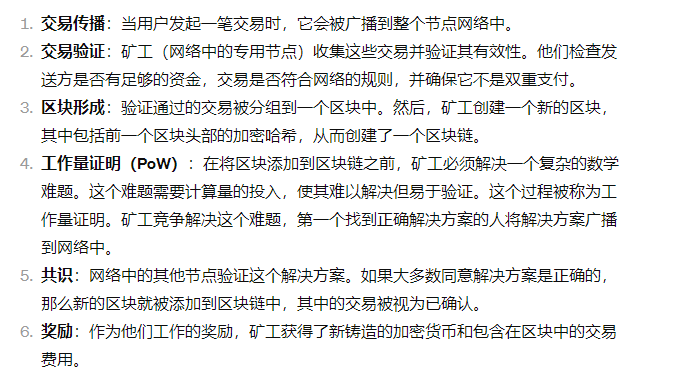


consensus rules 共识规则

Each full node in the Bitcoin network independently stores a block chain containing only blocks validated by that node. **When several nodes all have the same blocks in their block chain, they are considered to be in consensus.**

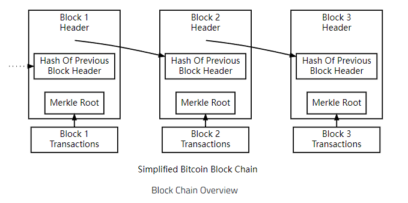

>A [block](https://developer.bitcoin.org/glossary.html#term-Block) of one or more new transactions is collected into the transaction data part of a block. Copies of each transaction are hashed, and the hashes are then paired, hashed, paired again, and hashed again until a single hash remains, the [merkle root](https://developer.bitcoin.org/glossary.html#term-Merkle-root) of a merkle tree.
>
>一个或多个新交易的区块被收集到区块的交易数据部分中。 每个交易的副本都会被散列，然后散列被配对、散列、再次配对、再次散列，直到剩下一个散列，即默克尔树的默克尔根。
>
>The merkle root is stored in the block header.
>
>Each block also stores the hash of the previous block’s header, chaining the blocks together.


## 哈希树

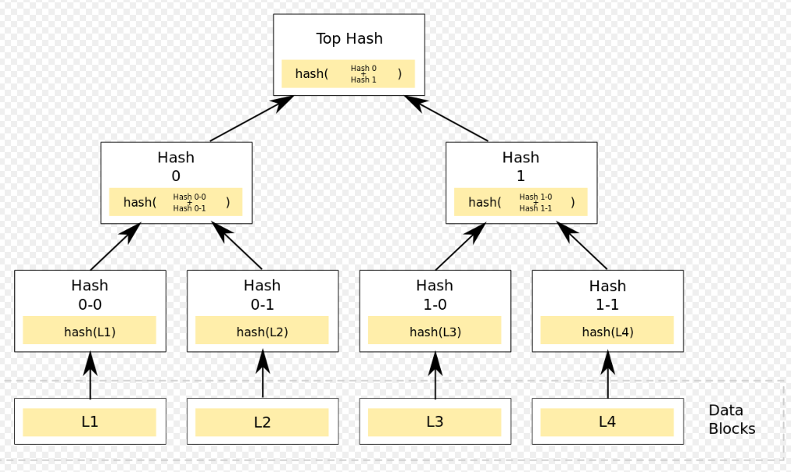

其中每个“叶子”（节点)都标有数据块的密码哈希

并且每个不是叶子的节点（称为*分支*、*内部节点）*，或*inode*）用其子节点标签的加密哈希进行标记


## satoshis

The satoshi is the smallest denomination of the cryptocurrency bitcoin. It is named after Satoshi Nakamoto, the Bitcoin creator(s). The satoshi to bitcoin ratio is 100 million satoshis to one bitcoin.


## transaction

Transactions are also chained together. Bitcoin wallet software gives the impression that satoshis are sent from and to wallets, but bitcoins really move from transaction to transaction. Each transaction spends the satoshis previously received in one or more earlier transactions, so **the input of one transaction is the output of a previous transaction.**

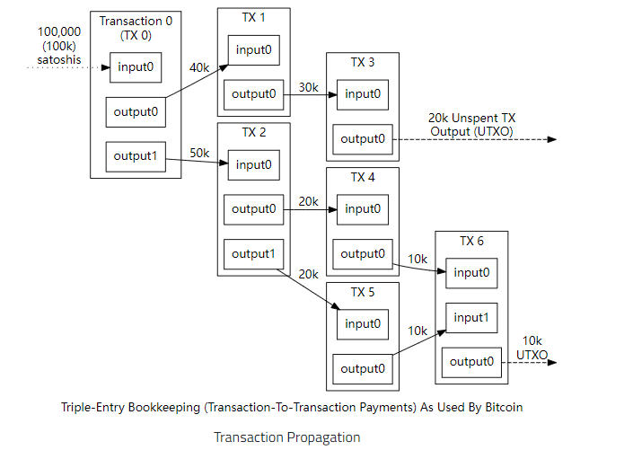

Outputs are tied to transaction identifiers (TXIDs), which are the hashes of signed transactions.

> Because each output of a particular transaction can only be spent once, the outputs of all transactions included in the block chain can be categorized as either Unspent Transaction Outputs (UTXOs) or spent transaction outputs. For a payment to be valid, it must only use UTXOs as inputs.

> if the value of a transaction’s **outputs exceed its inputs, the transaction will be rejected**but if the inputs exceed the value of the outputs, any difference in value may be claimed as a transaction fee by the Bitcoin miner who creates the block containing that transaction. For example, in the illustration above, each transaction spends 10,000 satoshis fewer than it receives from its combined inputs, effectively paying a 10,000 satoshi transaction fee.

### proof of Work POW 工作量证明


# 算法基础

## 共识算法

### 拜占庭容错

1. 什么是拜占庭容错？

​	在一个不可靠的网络环境中，若系统或节点在最终任然能够提供正确的结果而不受到错误或恶意节点的影响，则称为达到了拜占庭容错。


2. 拜占庭容错的用途

​	在未来对恶意攻击和软件漏洞中 起到重要作用

3. 拜赞庭将军问题是一个经典的同步问题


### 实用拜占庭算法

1. 别的算法的缺陷

在之前的算法中  实际运用时 效率太慢 在同步的环境下进行

Rampart 和 SecureRing 用于实际传输中单依赖于同步网络正确传输下的假设   

``` python
An attacker may compromise the safety of a service by delaying non-faulty nodes or the communication between them until they are tagged as faulty and excluded from the replica group. Such a denial-of-service attack is generally easier than gaining control over a non-faulty node.

攻击者可能会通过延迟非故障节点或它们之间的通信来损害服务的安全，直到它们被标记为故障并被排除在副本组之外。这种拒绝服务攻击通常比获得对非故障节点的控制更容易。
```


2. 实用拜赞庭算法的优点

在故障节点出错时也能达到拜赞庭容错

实用拜占庭算法对之前的拜赞庭算法进行优化 减少了一个数量级的响应时间

比标准的不复制的网络文件系统慢了3%

```mark
It uses only one message round trip to execute read-only operations and two to execute read-write operations. Also, it uses an efficient authentication scheme based on message authentication codes during normal operation; public-key cryptography, which was cited as the major latency [29] and throughput [22] bottleneck in Rampart, is used only when there are faults.
它只使用一个消息往返来执行只读操作，两个来执行读写操作。此外，它在正常运行期间使用基于消息身份验证代码的高效身份验证方案；公钥加密被引用为Rampart的主要延迟和吞吐量瓶颈，仅在出现故障时使用。
```

**核心benchmark来对性能进行评估 **


**核心理论**

> n≥3f+1。其中，n是系统中的总节点数，f是允许出现故障的节点数。也就是说，如果这个系统允许出现f个故障，那么这个系统必须有n个节点，才能解决故障
> 该模型下，有一个节点会被当做主节点，而其他节点都是备份节点（副本节点）。系统内的所有节点都会相互通信，旨在实现节点能以少数服从多数的原则达成数据的共识。如果主节点出现明显的撒谎迹象，那么其他的节点可以联合起来更换主节点

实用拜占庭容错算法的共识过程通常包含以下四个步骤：

>第一步，客户端发一个请求给主节点去执行某个操作；
>
>第二步，主节点广播这个请求到各个备份节点；
>
>第三步：包括主节点在内的所有备份节点在收到准备消息之后，对消息进行验证，确认信息无误后，执行操作，并把结果返回给客户端；
>
>第四步，结果反馈：当客户端收到 3f +1 个来自不同节点的相同的结果后，过程结束。
>
>只要客户端能保证多数人认可同一个结果，那么这个结果就是最终的共识。

## DPP (drift-plus-penalty)漂移加惩罚算法

优化排队网络和其他随机系统

(类似CDMA/CD)在一个特定的函数(规则)下。

**可扩展性仍然是阻止区块链技术被广泛采用的障碍**。


## 区块链分片技术Sharding

1. **网络分片 network sharding**

   > 网络分片是通过一定的组织方式将整个网络分成不同的分片，各个分片并行处理整个区块链中的部分交易，各部分的交易完全不相同，从而同时完成多笔交易的验证。
   > 为了避免恶意节点过分填充一个分片、从而控制网络，通过可验证随机函数VRF，每隔一段时间随机抽取节点形成分片。

2. **交易分片 transaction sharding**
   交易分片使得各个网络分片对交易具有更强的处理能力，将客户端的跨片交易分成若干个相关的子交易，不同分片的跨片易可以并行处理。
   但是在基于UTXO的账本系统，一笔交易可能由多个输入和多个输出构成，因此一般通过交易的hash值分片。为了防止双花交易，必须要在所有分片间建立通讯。但是这种相互之间的通信开销可能会破坏交易分片的扩容效果。 ​ 在基于帐户的系统，每个交易都将具有发件人的地址，通过发件人地址分片，造成双花的两笔交易会在同一个分片中得到验证，因此不需要在不同的分片中建立通讯，避免额外的通讯开销。

3. **状态分片 state sharding**
   状态分片是将各部分完全不同的账本分别存储在各个分片(分片内的节点往往存储同一版本的账本)，整个分片网络组成一个完整的账本，可以减少各个节点存储账本的压力。
   状态分片的关键是将整个存储区分开，让不同的分片存储不同的部分，每个节点只负责托管自己的分片数据，而不是存储完整的区块链状态。可以减少状态的冗余存储，使得整个区块链网络具有存储的可扩展性。 ​ 但是状态分片有以下几个问题需要解决，1）会导致频繁的跨片通讯；2）由于系统状态没有在所有分片中复制，因此网络一旦有交易的输入是来自脱机的分片，那么这笔交易将无法得到验证；3）而且由于每个分片只保留了状态的一部分，所以在每次重新调整网络的过程中，必须要考虑防止调整过大而导致在同步完成前可能会出现的整个系统失效的问题；


# 论文

## 区块链节点类型

 There are different types of nodes available, the two most common are full nodes (nodes that store all blockchain transactions in their memory) and lightweight nodes (nodes that just store the block headers, saving a ton of time and memory).


## 符号表

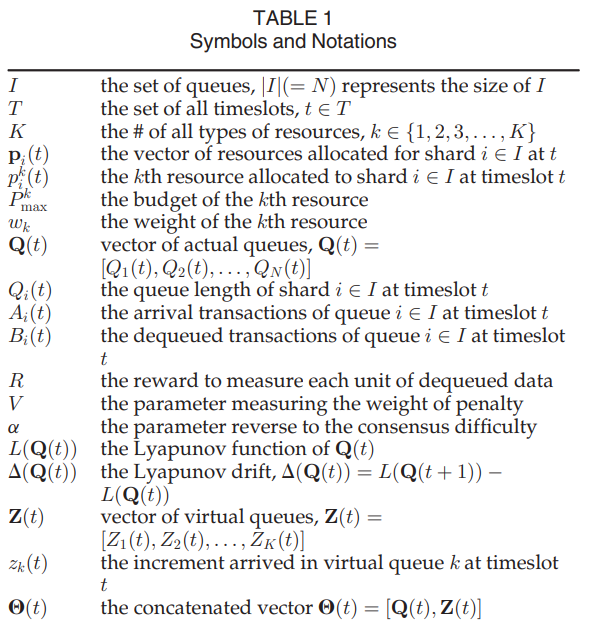

>I 在存储区中的队列的集合  |I|表示I的大小
>
>i表示每个队列的索引
>
>T 设定的所有时隙 时间段 集合   给定参数运行多少时隙
>
>K 所有类型的资源 k为整数  资源类型包括存储 网络带宽 等等 可以被分配在permission sharded blockchain 
>
>Pi(t) 在t时刻可以被分配给分片的资源
>
>pi^k(t) 第k种个资源被用于投资在分片i上在一个时隙t内用以产生collation block 的数量
>
>pmax^k 第k种资源的最大预算
>
>Wk  k类资源的权重
>
>Q(t) 队列向量集
>
>Qi(t) 代表了分片i的队列长度 在t时隙开始时
>
>Ai(t) 在t时隙内 到达第i个分片的交易量
>
>Bi(t) 在每个时隙内 第i分片需要处理的交易数量
>
>这个值接近于Pi(t)
>
>R  当数据出队时所获交易时用于测算结果 所定义的 交易执行的奖励参数
>
>V  衡量惩罚权重的参数    设置 大于0小于1  表示分片对收益的侧重程度 0
>
>- 0只考虑队列稳定性
>- \>0 同时考虑队列稳定性和资源损耗的联合优化
>
>alpha 反应了网络连接的正常水平  共识速度 大于0小于1
>
>- alpha 越大 在给定相同的资源的情况下 生成collation block越简单
>
>Ci(t) 网络分片i在时隙t内消耗的资源数量
>
>L(Q(t)) Lyapunov 函数 在Q(t)条件下
>
>Z(t) 虚拟队列向量
>
>zk(t)  增量在时隙到达k 时的虚拟队列
>
>O(t)  连接向量 
>
>pen(t) 用于计算总的消耗量将去交易进程的付款
>
>P* 最佳资源分配结果

## 计算公式

the data amount processed by shard i at timesolt t is calculated as follows

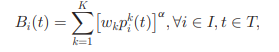

the queue-length evolution :

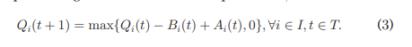

the numerical resource consumption by the network shard

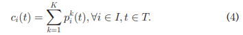


To integrate those two conflict goals together, we devise a **penalty function**, which is calculated by the total resource consumption defined in Eq. (4) minus the TX-processing payoff.

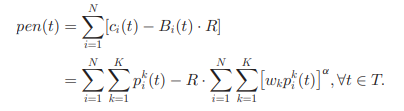

To quantitatively measure the size of the vectorQ(t)

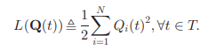

one-timeslot conditional Lyapunov drift

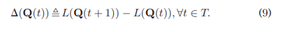

the update equation of Zk(t)

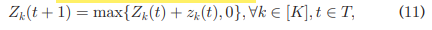

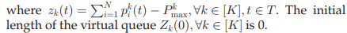

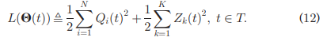

drift-plus-penalty

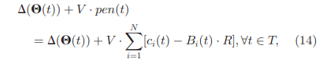


## UTXO-base transaction model

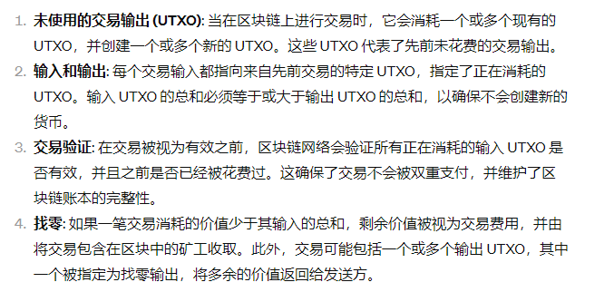


## transaction

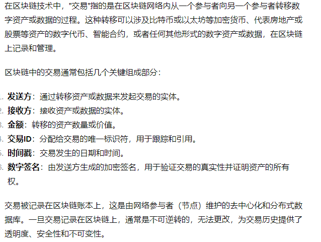


## PBFT-based sharded permissioned blockchain

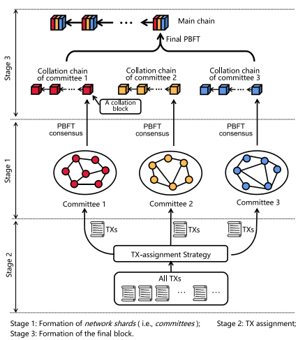

stage1 

blockchain 网络 分片为几个不同的基于PDFT共识协议的committee(network shards)

stage2

将所有的交易订单根据 分配策略 分发给三个committee

每个片独立 并行处理不同组的分配事物  实现交易处理的高吞吐量

stage3 

> 整理每个分片 执行PBFT共识 在主链上形成一个新的区块 collation block  每个shard 形成的collation block 组成一个collation chain
>
> 每个collation chain 中拿一个block 执行PBFT 后形成一个block 放置在主链上
>
> 将几个committee 整理成一个区块 放入主链中
>
> 计算能力主要用于执行 工作量证明的分片的创建
>
> 同时利用网络带宽来运行 PBFT 共识协议生成新块。


## Blockchain shards

在碎片链上产生的block 叫 collation blocks 这个block 被所有的矿工验证过 矿工也叫collators collators 是被block validator 选出来的

在进入blockchain网络的时候 通过 validator manager contract （VMC） VMC是分片机器的核心

每一块碎片拥有一块存储区 在每个片中有一个存储池 当有交易到达是暂时被存储在这块区域 等待被分片处理

当一个新的交易被分配给一个网络碎片时 被分片中的节点确认

交易第一次到达的时候

确认后 交易会被存储在存储区中 并且广播给其他的分片内的节点 不止是矿工

否则就回交易会被拒绝

在每个纪元开启时 矿工 将会选择从存储池中选择一个交易集

来生成一个collation block 

若一个矿工每个纪元都赢得了挖矿 计算数学难题 hash 才广播 挖矿不止一次

就回广播新的collation block 给他的片内成员 来确定新的块

之后新的 collation block 将会被添加到 分片的collation chain 

并且所有的在collation block 上的交易 将会从当前的碎片的内存池中删除


## Threat Model of Bursty-TX Injection Attack


## Algorith Design

## Basic Setting for Numerical Simulation


# 专有名词

digital currencies 数字货币 

ledger 账本

blockchain games区块链游戏 

vehicles汽车 

internet of things物联网  

bitcoin 比特币

medical treatment solutions医疗解决方案

the blockchain architecture区块链架构

decentralized 去中心化

Ethereum 以太坊

proof of work （PoW） 工作证明

Validators 验证者

scenario 设想

proof of concept (PoC)

cryptographic

cryptocurrency 加密货币

manipulated 操纵

skewed倾斜

etc 等等

pros and cons 优点 缺点

merkle tree 哈希树

Elastic Resource Allocation Against Imbalanced Transaction Assignments in Sharding-Based Permissioned Blockchains

基于分片的许可区块链中针对不平衡交易分配的弹性资源分配


transaction TX

Unspent TX Output  UTXO 未花费输出

stochastic随机

 digital asset 数字资产
